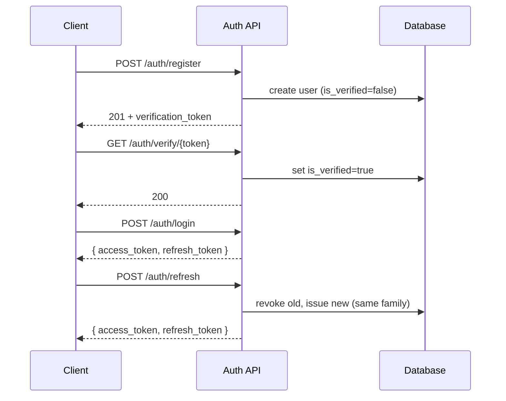

# 🌍 AetherLab

**Environmental Intelligence & Autonomous Agent Platform**

[](https://www.python.org/)
[](https://fastapi.tiangolo.com/)
[](https://nextjs.org/)
[](https://www.postgresql.org/)
[](https://www.sqlalchemy.org/)
[](https://www.typescriptlang.org/)
[]()
[](/LICENSE)

AetherLab is an **intelligent environmental intelligence platform** that combines **geospatial data, live weather, air quality, satellite imagery, and autonomous AI agents** into one secure, production-grade product. Users monitor the world around them, manage projects and agents, and converse with AI assistants backed by interchangeable LLM providers — all served by a **FastAPI** backend and a **Next.js** frontend.

> This project is engineered to enterprise standards: layered architecture, versioned APIs, token rotation, rate limiting, structured logging, Prometheus metrics, a 120-test suite, containerized frontend deployment, and GitHub Actions CI/CD.

---

## 🚀 Key Capabilities

| Domain | Capabilities |
|--------|--------------|
| **🔐 Identity** | Register → email verification → login → **rotating refresh tokens** with reuse detection. bcrypt hashing, strict password policy, per-user ownership & access control |
| **📁 Projects** | Create / list / update / soft-archive projects with strict data isolation between users |
| **🤖 Agents** | Configure autonomous AI agents per project (model, temperature, system prompt, JSON config, lifecycle status) |
| **💬 Conversations** | Persistent per-project chat history with an LLM-powered reply flow |
| **🌍 Environmental** | Ingest live weather (OpenWeather) & air quality (OpenAQ); query latest / historical / geofenced readings; optional Celery ingestion |
| **🧩 AI Providers** | Pluggable `LLMProvider` abstraction (OpenAI impl) behind a factory. **Free Nemotron model via OpenRouter by default** |
| **📈 Observability** | **Prometheus metrics** (`/metrics` scrape endpoint) with per-request counts & latency histograms, Sentry error/performance monitoring, JSON structured logging with request-ID correlation |
| **🛡️ Hardening** | Rate limiting (slowapi), health-check liveness probes, CORS policy, JWT secret validation, sensitive-data log redaction |
| **🖥️ Frontend** | Next.js 15 app for auth, dashboard, projects, agents, chat & environmental maps/gauges, with server-side auth middleware & error boundaries |
| **⚙️ Ops** | Docker-ready, environment-aware config (dev/test/prod), Alembic migrations, GitHub Actions CI |

---

## 🏗️ Architecture

The system uses a **defense-in-depth, layered backend** with a separate frontend, joined by a versioned, JWT-secured REST API.

```
                        ┌────────────────────────────┐
   Browser  ───────────►│   Next.js Frontend         │
   (Next.js App)        │   • Auth middleware        │
                        │   • React Query + Zustand  │
                        └────────────┬───────────────┘
                                     │ HTTPS / REST (JWT Bearer)
                                     ▼
              ┌──────────────────────────────────────┐
              │            FastAPI Backend           │
              │   /api/v1  (versioned, rate-limited) │
              │   api → services → repositories → models
              └───────┬──────────────────┬───────────┘
                      │                  │
               PostgreSQL          External providers
               (SQLAlchemy + Alembic)  (OpenWeather, OpenAQ, OpenRouter/OpenAI)
```

**Key principles**

| Principle | Implementation |
|-----------|----------------|
| Layering | `api → services → repositories → models`; schemas separate network contracts from ORM models |
| Versioning | All routes under `/api/v1` — non-breaking evolution |
| Tenancy | Every resource is scoped to the authenticated **owner**; cross-user access returns `404` |
| Security | JWT access + rotating refresh tokens, bcrypt, verified-email gate, rate limits |
| Testability | In-memory SQLite + mocked LLM for fast, deterministic, external-service-free tests |

---
## 🧰 Technology Stack

### Backend

| Layer | Technology | Purpose |
|-------|-----------|---------|
| Web framework | [FastAPI](https://fastapi.tiangolo.com/) | Async-native, OpenAPI-generated REST API |
| Validation | [Pydantic v2](https://docs.pydantic.dev/) + `pydantic-settings` | Request/response contracts & env config |
| ORM | [SQLAlchemy 2.x](https://www.sqlalchemy.org/) | Typed, declarative model layer |
| Migrations | [Alembic](https://alembic.sqlalchemy.org/) | Versioned schema evolution |
| Database | [PostgreSQL 17](https://www.postgresql.org/) | Primary store |
| Auth | [python-jose](https://python-jose.readthedocs.io/) + [passlib/bcrypt](https://passlib.readthedocs.io/) | JWT + password hashing |
| Rate limiting | [slowapi](https://github.com/laurentS/slowapi) | Per-endpoint in-memory limits |
| Task queue | [Celery](https://docs.celeryq.dev/) | Optional scheduled environmental ingestion |
| AI SDK | [OpenAI SDK](https://github.com/openai/openai-python) | Behind a provider abstraction |
| Server | [uvicorn](https://www.uvicorn.org/) | ASGI server |
| Testing | [pytest](https://docs.pytest.org/) + FastAPI `TestClient` | 120-test suite |

### Frontend

| Layer | Technology | Purpose |
|-------|-----------|---------|
| Framework | [Next.js 15](https://nextjs.org/) (App Router) | Full-stack React app + SSR |
| Language | [TypeScript 5](https://www.typescriptlang.org/) | Statically-typed frontend |
| UI toolkit | [Tailwind CSS](https://tailwindcss.com/) + Radix primitives | Responsive, accessible UI |
| State | [Zustand](https://zustand-docs.vercel.app/) | Persistent client auth store |
| Data | [TanStack React Query](https://tanstack.com/query) | Server-state caching |
| Charts/Map | [Recharts](https://recharts.org/) + [React Map GL](https://visgl.github.io/react-map-gl/) | Trends, gauges & geospatial views |

---

## 📁 Repository Structure

```
AetherLab/
├── .github/
│   └── workflows/ci.yml        # GitHub Actions CI (backend + frontend)
├── backend/
│   ├── alembic/                 # Schema migrations
│   │   └── versions/           # 7 revisions (users → … → refresh tokens)
│   ├── app/
│   │   ├── api/                 # Route handlers (v1)
│   │   ├── core/                # config, security, logging, rate limiter
│   │   ├── db/                  # SQLAlchemy engine/session/Base
│   │   ├── dependencies/        # get_db, get_current_user
│   │   ├── exceptions/          # typed app errors + handlers
│   │   ├── models/              # SQLAlchemy models
│   │   ├── repositories/        # data access layer
│   │   ├── schemas/             # Pydantic contracts
│   │   ├── services/            # business logic (use-cases)
│   │   ├── tasks/               # optional Celery ingestion
│   │   └── ai/                  # LLM provider abstraction + factory
│   └── tests/                   # pytest suite (conftest auto-verifies users)
├── frontend/
│   ├── app/                     # Next.js routes (public + authenticated groups)
│   ├── components/              # UI + feature components
│   ├── hooks/                   # React Query hooks
│   ├── lib/                     # API client, auth store, providers
│   ├── types/                   # TypeScript mirrors of Pydantic schemas
│   ├── Dockerfile               # Multi-stage, npm-based container
│   └── middleware.ts            # Edge auth-route protection
├── .env.example                 # Env template (safe to commit)
├── requirements.txt             # Python dependencies
└── README.md
---

## ⚡ Getting Started

### 1. Prerequisites

| Tool | Version / Notes |
|------|-----------------|
| Python | 3.11+ (3.12 recommended for CI) |
| PostgreSQL | 17 (or SQLite for local experimentation) |
| Node.js | 20 (matches CI and the frontend Docker image) |
| Docker | Required for the containerized frontend |

### 2. Clone the repository

```bash
git clone https://github.com/721189/AetherLab.git
cd AetherLab
```

### 3. Configure the backend

```bash
cd backend
python -m venv .venv
# Windows:  .venv\Scripts\activate        macOS/Linux:  source .venv/bin/activate
pip install -r ../requirements.txt
```

Create your environment file from the template (never commit real secrets):

```bash
cp ../.env.example .env      # then edit values
```

At minimum set `DATABASE_URL` and a strong `SECRET_KEY` (≥ 32 chars).

### 4. Initialize the database schema

```bash
alembic upgrade head          # applies all migrations
```

To experiment without PostgreSQL, point `DATABASE_URL` at SQLite:
`sqlite:///./aetherlab.db`.

### 5. Run the backend

```bash
uvicorn app.main:app --reload --host 0.0.0.0 --port 8000
```

Interactive docs: <http://localhost:8000/docs>  ·  ReDoc: <http://localhost:8000/redoc>

### 6. Run the frontend

```bash
cd ../frontend
cp .env.local.example .env.local   # set NEXT_PUBLIC_API_URL
npm install
npm run dev                        # http://localhost:3000
```

---

## ⚙️ Configuration

### Backend environment variables

| Variable | Description | Default |
|----------|-------------|---------|
| `APP_NAME` | Application name shown in docs | `AetherLab API` |
| `APP_ENV` | `development`, `testing`, or `production` | `development` |
| `DEBUG` | Enable debug-level logging | `False` |
| `DATABASE_URL` | SQLAlchemy connection string (**required**) | — |
| `SECRET_KEY` | JWT signing key, ≥ 32 chars (**required**, never default) | — |
| `ACCESS_TOKEN_EXPIRE_MINUTES` | Access-token lifetime | `30` |
| `REFRESH_TOKEN_EXPIRE_MINUTES` | Refresh-token lifetime | `10080` (7 days) |
| `REDIS_URL` | Redis connection string | `redis://localhost:6379/0` |
| `OPENROUTER_API_KEY` | **Preferred** free LLM key (Nemotron via OpenRouter) | — |
| `OPENROUTER_SITE_URL` | App URL sent to OpenRouter | `https://aetherlab.app` |
| `LLM_MODEL` | Default agent model | `nvidia/nemotron-4-340b-base` |
| `OPENAI_API_KEY` | *Paid fallback* LLM provider (omit when using OpenRouter) | — |
| `OPENWEATHER_API_KEY` | Weather ingestion | — |
| `OPENAQ_API_KEY` | Air-quality ingestion | — |
| `CORS_ORIGINS` | Allowed browser origins | `[]` |

> 💡 **Keep AI free:** set `OPENROUTER_API_KEY` and leave `OPENAI_API_KEY` empty. The factory **prefers OpenRouter** whenever its key is present, so agent replies use free Nemotron models and never bill you.

### Frontend environment variables

| Variable | Description |
|----------|-------------|
| `NEXT_PUBLIC_API_URL` | Base URL of the backend API, e.g. `http://localhost:8000` |

> **Security:** never commit real `.env*` values. The repo ignores `.env*` and only tracks the `.env.example` template.
---

## 🔐 Authentication & Security

AetherLab uses a **short-lived access token + rotating refresh token** model with mandatory **email verification** before first login.

### Identity lifecycle



### Security controls

| Control | Details |
|---------|---------|
| **Password hashing** | bcrypt via passlib; constant-time verification |
| **Password policy** | ≥ 12 chars, upper + lower + digit + special |
| **Email normalization** | Trim + lowercase before storage/lookup |
| **Email verification** | Account cannot log in until verified (`login` returns `401 Email not verified`) |
| **Access token** | Signed JWT (`HS256`), 30-min default lifetime |
| **Refresh token** | Signed JWT with `type=refresh`, `family`, `jti` claims; **stored SHA-256 hashed**, never plaintext |
| **Rotation + reuse detection** | Using a refresh token revokes it and issues a new one in the same family. **Replaying an already-rotated token revokes the entire family** (theft signal) |
| **Rate limiting** | slowapi in-memory limits per endpoint (see rate limits below) |
| **Tenancy** | Every project/agent/conversation is owner-scoped; cross-user access → `404` |
| **Request IDs** | Every response carries `X-Request-ID` for tracing |
| **Log redaction** | Secrets (`access_token`, `refresh_token`, `authorization`, keys) scrubbed from logs |

> **Refresh-token model:** tokens are only ever stored **hashed**; the raw value is returned once at issuance. This mirrors the email-verification hardening and limits exposure if the database is compromised.

### Endpoint map (authentication)

| Method | Path | Auth | Purpose |
|--------|------|------|---------|
| `POST` | `/api/v1/auth/register` | ❌ | Create account → returns `verification_token` |
| `GET` | `/api/v1/auth/verify/{token}` | ❌ | Confirm email, unlock login |
| `POST` | `/api/v1/auth/resend-verification` | ❌ | Re-issue a verification token |
| `POST` | `/api/v1/auth/login` | ❌ | Issue `{ access_token, refresh_token }` |
| `POST` | `/api/v1/auth/refresh` | ✅ | Rotate the refresh token |
| `GET` | `/api/v1/auth/me` | ✅ | Current user profile |

---
## 📡 API Reference

All routes are versioned under `/api/v1`. `docs/` serves an interactive OpenAPI/Swagger UI; `redoc/` serves ReDoc. Authenticated routes accept a `Authorization: Bearer <access_token>` header.

### Health

| Method | Path | Auth | Description |
|--------|------|------|-------------|
| `GET` | `/api/v1/health` | ❌ | Liveness probe: `{"status":"ok","database":"connected"\|"unavailable"}` |

### Projects

| Method | Path | Auth | Description |
|--------|------|------|-------------|
| `POST` | `/api/v1/projects/` | ✅ | Create a project |
| `GET` | `/api/v1/projects/` | ✅ | List own projects (`?skip=&limit=`) |
| `GET` | `/api/v1/projects/{id}` | ✅ | Get a project (owner only) |
| `PATCH` | `/api/v1/projects/{id}` | ✅ | Update a project (owner only) |
| `DELETE` | `/api/v1/projects/{id}` | ✅ | Soft-delete (archive) a project |

### Agents

| Method | Path | Auth | Description |
|--------|------|------|-------------|
| `POST` | `/api/v1/projects/{pid}/agents/` | ✅ | Create an agent in a project |
| `GET` | `/api/v1/projects/{pid}/agents/` | ✅ | List agents (`?skip=&limit=`) |
| `GET` | `/api/v1/projects/{pid}/agents/{id}` | ✅ | Get an agent |
| `PATCH` | `/api/v1/projects/{pid}/agents/{id}` | ✅ | Update an agent |
| `DELETE` | `/api/v1/projects/{pid}/agents/{id}` | ✅ | Archive an agent |

### Conversations & Messages

| Method | Path | Auth | Description |
|--------|------|------|-------------|
| `POST` | `/api/v1/projects/{pid}/conversations/` | ✅ | Start a conversation |
| `GET` | `/api/v1/projects/{pid}/conversations/` | ✅ | List conversations |
| `GET` | `/api/v1/projects/{pid}/conversations/{cid}` | ✅ | Get a conversation |
| `PATCH` | `/api/v1/projects/{pid}/conversations/{cid}` | ✅ | Update a conversation |
| `DELETE` | `/api/v1/projects/{pid}/conversations/{cid}` | ✅ | Delete a conversation |
| `POST` | `/api/v1/projects/{pid}/conversations/{cid}/messages` | ✅ | Send a message → LLM reply |

### Environmental Intelligence

| Method | Path | Auth | Description |
|--------|------|------|-------------|
| `GET` | `/api/v1/environmental/latest?location_name=` | ❌ | Most recent readings for a location |
| `GET` | `/api/v1/environmental/historical?location_name=&hours=` | ❌ | Readings within `N` hours |
| `GET` | `/api/v1/environmental/readings/{id}` | ❌ | Full reading by ID |
| `GET` | `/api/v1/environmental/?lat=&lon=&radius_km=` | ❌ | Simplified geofence query |

---

## 🚦 Rate Limiting

Limits are enforced with **slowapi** (shared in-memory limiter, keyed by client IP):

| Endpoint | Limit |
|----------|-------|
| Register | 3/minute |
| Login | 5/minute |
| Verify / Resend | 10 & 3 per minute |
| Refresh | 5/minute |
| Health | 60/minute |
| Default (all others) | 1000/hour |

Responses include the structured `429` body `{ "detail": "Rate limit exceeded", "code": "rate_limit_exceeded" }`.

> Tests run with the limiter **disabled** (conftest autouse fixture) so the full 120-test suite never trips a per-IP cap.

---

## 🧪 Quick API Walkthrough (curl)

```bash
BASE=http://localhost:8000/api/v1

# 1. Register (returns a verification_token)
curl -X POST $BASE/auth/register \
  -H "Content-Type: application/json" \
  -d '{"email":"you@example.com","password":"StrongPass123!"}'

# 2. Verify email (replaces the placeholder with the token above)
curl "$BASE/auth/verify/<verification_token>"

# 3. Login → access + refresh tokens
curl -X POST $BASE/auth/login \
  -H "Content-Type: application/json" \
  -d '{"email":"you@example.com","password":"StrongPass123!"}'
# → {"access_token":"...","refresh_token":"...","token_type":"bearer"}

TOKEN="<access_token>"

# 4. Rotate the refresh token (revokes old, issues new pair)
curl -X POST $BASE/auth/refresh \
  -H "Content-Type: application/json" \
  -d '{"refresh_token":"<refresh_token>"}'

# 5. Create a project
curl -X POST $BASE/projects/ \
  -H "Authorization: Bearer $TOKEN" \
  -H "Content-Type: application/json" \
  -d '{"name":"My Garden","description":"Backyard climate monitoring"}'

# 6. Query environmental intelligence
curl "$BASE/environmental/latest?location_name=Delhi"
curl "$BASE/environmental/historical?location_name=Delhi&hours=24"
```

---
---

## 🗄️ Database Schema & Migrations

Migrations are managed with **Alembic**. Run from `backend/`:

```bash
alembic upgrade head          # apply all pending
alembic downgrade -1          # roll back one revision
alembic history               # inspect history
alembic revision --autogenerate -m "describe change"   # after model edits
```

### Schema lineage (head → newest direction)

| Revision | Change |
|----------|--------|
| `a86209563be9` | Create `users` |
| `b3f7a9c1d2e4` | Create `projects` |
| `c4d8e0f2a6b1` | Create `agents` |
| `e5f9a1c3d7b2` | Create `conversations` + `messages` |
| `f7a3b2c5d9e1` | Create `environmental_readings` |
| `b3c4d5e6f708` | Add email-verification columns to `users` |
| `a1e2f3b4c5d6` | Create `refresh_tokens` (**head**) |

### Relationship overview

```
users ──► refresh_tokens         (own refresh families)
  │
  └─► projects ──► agents
         │
         └─► conversations ──► messages
environmental_readings   (independent weather + air-quality snapshots)
```

`refresh_tokens` stores only **SHA-256 hashes** and links each token to a `family_id` lineage; `replaced_by_id` records rotation chaining.

---

## 🧪 Testing

A **120-test suite** (`pytest`) covers the full vertical slice — register → verify → login → project → agent → conversation → AI reply — plus exhaustive negative cases (wrong password, unverified accounts, cross-user access, invalid/duplicate payloads, expired & replayed tokens).

```bash
cd backend
python -m pytest                  # full suite (120 passed)
python -m pytest tests/test_auth.py -v
python -m pytest tests/test_projects.py tests/test_agents.py -v
```

Tests use an **in-memory SQLite** database and a **mocked LLM provider** — fast, deterministic, and require **no external services**. The `conftest.py` fixture overrides `get_db`, disables slowapi, and provides `register_and_verify()` to auto-verify test users (the exact flow the API uses).

---

## ⚙️ CI/CD (GitHub Actions)

Every push to `main` and every pull request triggers **two independent jobs** (`.github/workflows/ci.yml`):

| Job | Runner | Steps |
|-----|--------|-------|
| **Backend · pytest** | ubuntu + Python 3.12 | Normalise `requirements.txt` for Linux (UTF-16 → UTF-8, drop Windows-only pkgs) → `pip install -r` → `pytest` |
| **Frontend · typecheck + build** | ubuntu + Node 20 | `npm ci` → `tsc --noEmit` → `npm run build` |

The CI step is safe on Windows-authored files: it fixes the PowerShell `pip freeze` encoding and filters Windows-only packages so the Linux runner can install the rest.

---

## 📈 Observability

AetherLab ships three complementary observability layers: **Prometheus metrics**, **Sentry** error/performance monitoring, and **JSON structured logging** with request-ID correlation.

### Prometheus metrics

`app/core/metrics.py` instruments every HTTP request and exposes a scrape endpoint at **`GET /metrics`**:

| Metric | Type | Labels | Description |
|--------|------|--------|-------------|
| `http_requests_total` | counter | `method`, `endpoint`, `status` | Total HTTP requests served |
| `http_request_duration_seconds` | histogram | `method`, `endpoint` | Request latency distribution (bucketed) |

Design highlights:

- **Bounded cardinality** — labels use the *templated* route path (e.g. `/projects/{project_id}`) rather than raw URLs, so requesting 10 000 different project IDs produces one time series, not 10 000. Unrouted requests (404s) fall back to the raw path.
- **No self-counting feedback loop** — `/metrics` is deliberately excluded from instrumentation, so scraping never inflates its own counters.
- **Outermost middleware** — `register_metrics(app)` runs last in `main.py`, so Prometheus observes the full request lifecycle, including rate-limited `429` responses.
- **Streaming-safe** — implemented as native ASGI middleware rather than `BaseHTTPMiddleware`, so the SSE reply stream passes through untouched and latency is measured without an extra thread-pool hop.
- **Rate-limit exempt** — `/metrics` bypasses slowapi so frequent scrapes never trip a `429`.

Scrape it locally:

```bash
curl http://localhost:8000/metrics
```

Example output:

```text
# HELP http_requests_total Total HTTP requests, partitioned by method, endpoint and response status.
# TYPE http_requests_total counter
http_requests_total{endpoint="/",method="GET",status="200"} 1.0
http_requests_total{endpoint="/projects/{project_id}",method="GET",status="401"} 1.0
```

Minimal `prometheus.yml` scrape job:

```yaml
scrape_configs:
  - job_name: aetherlab-backend
    metrics_path: /metrics
    scrape_interval: 15s
    static_configs:
      - targets: ["localhost:8000"]
```

> ⚠️ **Production note:** `/metrics` is intentionally unauthenticated for simplicity. In hardened deployments bind it to an internal interface or protect it with a reverse proxy / network policy — it can leak endpoint topology and traffic volumes.

### Sentry

Activated only when `SENTRY_DSN` is configured (`init_sentry()` is otherwise a no-op), capturing exceptions, FastAPI/SQLAlchemy traces and log-level errors, with sensitive keys scrubbed and every event tagged with the request-scoped `request_id`.

### Structured logging

`app/core/logging.py` emits JSON logs with an `X-Request-ID` propagated through middleware and attached to Sentry events, so a single request's logs and errors are trivially correlated.

---

## 🛳️ Containerization (Frontend)

The frontend ships a **multi-stage, npm-based Dockerfile** (`frontend/Dockerfile`):

1. **base / deps** — install production deps from the lockfile
2. **builder** — full install + `npm run build` with `NEXT_PUBLIC_*` overridable as build args
3. **runner** — minimal non-root image with compiled app + `public` + config

```bash
cd frontend
docker build -f Dockerfile -t aetherlab-frontend \
  --build-arg NEXT_PUBLIC_API_URL=http://host.docker.internal:8000 .
docker run -p 3000:3000 aetherlab-frontend
```

`.dockerignore` excludes `node_modules`, `.next`, `.env*`, and build noise so the container is clean and secret-free.

---
## 🖥️ Frontend Application

The **Next.js 15** frontend (TypeScript, App Router, Tailwind + Radix UI) delivers the full product experience.

### Route groups

| Group | Public URL | Description |
|-------|-----------|-------------|
| `(auth)` | `/login`, `/register` | Email-based auth with verification-aware UX; authenticated users are redirected to `/dashboard` |
| `(dashboard)` | `/dashboard`, `/dashboard/projects`, `/dashboard/projects/[id]`, `/dashboard/agents`, `/dashboard/environmental` | Authenticated workspace |

### Resilience & UX

- **Auth middleware** (`middleware.ts`) — an **Edge** layer that protects `/dashboard/*` via the `auth-token` cookie and bounces authenticated users away from `/login` & `/register`. The cookie is kept in sync with the Zustand store (`setAuth`/`logout`) and guarded for SSR/static generation.
- **Error boundaries** (`components/ui/error-boundary.tsx`) — `ErrorBoundary` + `RetryOnError` clear the React Query cache and reload, so transient failures self-heal.
- **React Query + Zustand** — robust server-state caching and a persistent, auth-aware client store.
- **Rich dashboards** — AQI gauges, trend charts (Recharts), and geospatial views (React Map GL) for environmental data.

### Frontend structure

```
frontend/
├── app/            # (auth) & (dashboard) route groups
├── components/     # feature + ui primitives (dialogs, cards, charts, chat, maps)
├── hooks/          # useAuth, useProjects, useAgents, useConversations, useEnvironmental
├── lib/            # API client, auth/store, providers
└── types/          # TS mirrors of Pydantic schemas (Token, User, Project, Agent, …)
```

---

## 🛣️ Roadmap

- Stream responses end-to-end (provider layer already exposes `stream_response`)
- Agent ↔ conversation association and per-agent system prompts
- Tool use / function calling for agents
- Additional LLM providers (Anthropic, local OSS) via the factory
- Pagination metadata envelopes for list endpoints
- Backend containerization + Docker Compose for a one-command stack
- Refresh-token revocation endpoint & family audit UI

---

## 🤝 Contributing

1. Fork the repository and create a feature branch.
2. Follow the layered conventions: **schemas → models → repositories → services → api**.
3. Add tests alongside changes; the suite must stay green (`python -m pytest`).
4. Update this README when you change behavior or configuration.
5. Open a pull request — CI (backend pytest + frontend typecheck/build) must pass.

**Conventions:** versioned routes under `/api/v1`; typed Pydantic contracts; owner-scoped queries; secrets in env, never in code; migrations for every schema change.

---

## 📄 License

This project is licensed under the terms found in the [LICENSE](/LICENSE) file.

---

*AetherLab — monitor the environment. Automate the response.*
```